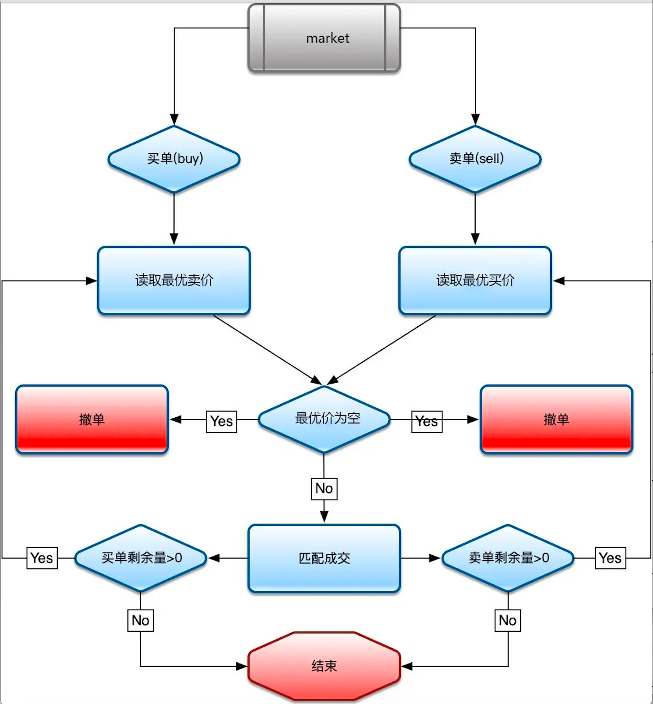
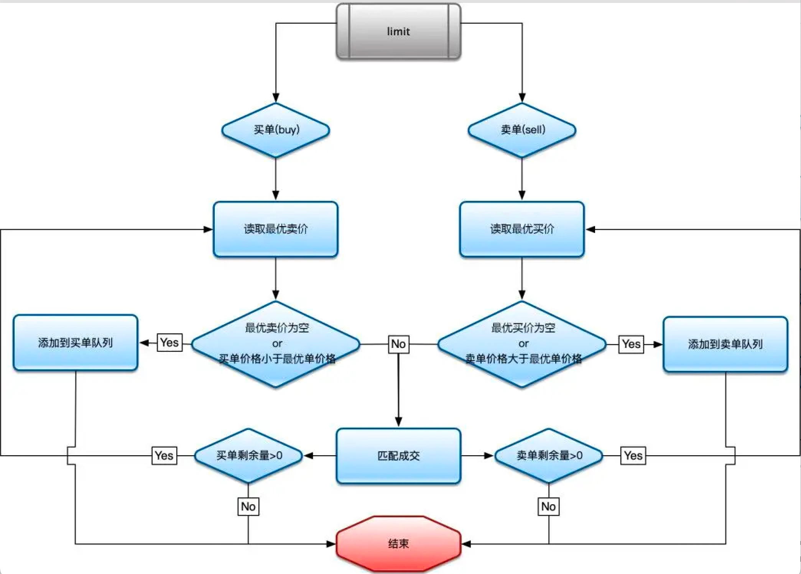
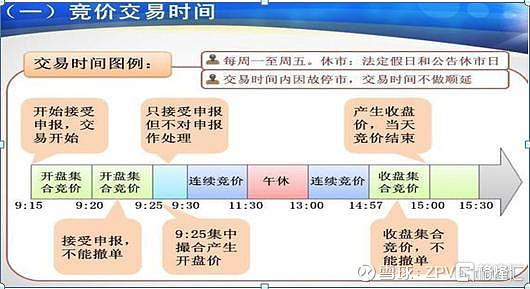
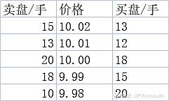
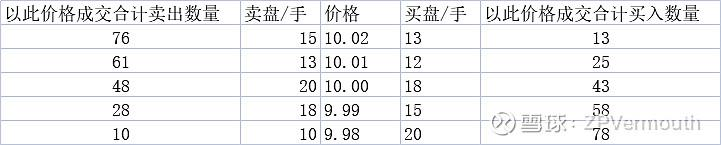
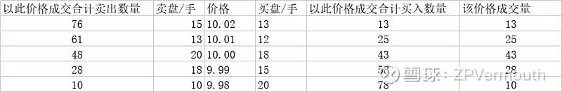
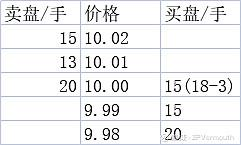
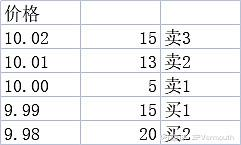

### 说明
此项目是基于此[事件溯源框架](https://github.com/654894017/cqrs)实现的,撮合引擎只是基于该框架的上层应用.

**https://github.com/654894017/cqrs**

### 实现功能

1. 市价单
2. 限价单
3. 集合竞价
4. 取消订单
5. 买卖n档查询
### 市价单流程

### 限竞价流程

### 集合竞价
给大家介绍一下集合竞价是怎么回事。

目前我国沪深两市的集合竞价交易机制主要为：沪深两市集合竞价时间为9点15分至9点25分，14点57分至15点00分。即时行情显示内容包括证券代码、证券简称、前收盘价格、虚拟开盘参考价格、虚拟匹配量和虚拟未匹配量。

在集合竞价过程中，9点15分至9点20分可以接收申报，也可以撤销申报，9点20分至9点25分可以接收申报，但不可以撤销申报。

集合竞价产生的开盘价需满足以下规则：

（1）成交量最大。

（2）高于开盘价的买入申报和低于开盘价的卖出申报全部成交。

（3）与开盘价相同的买卖双方中有一方申报全部成交。

特别地，如果产生最大成交量的价位有两个，若在上交所则选取中间价；若在深交所则选取离上日收盘价最近的价格。

下面给出一个例子说明集合竞价后的开盘价如何确定：

假设某天集合竞价阶段产生了五个交易价格。

那么接下来我们计算一下合计卖出或买入数量。将卖盘的手数从最低价开始累加（因为卖价越低越容易成交）；将买盘的手数从最高价开始累加（因为买价越高越容易成交）。

得到如下结果：

然后我们计算一下哪个价格下累计成交手数最多，做法是取左右两端的较小值进行比较。

10.00元的成交量为43手，最大。那么集合竞价确定的开盘价就是10.00元。

价格低于10.00元的卖出报价有9.99元：18手；9.98元：10手。

价格高于10.00元的买入报价有10.01元：12手；10.03元：13手。

那么根据：高于基准价格的买入申报和低于基准价格的卖出申报全部成交。买盘25手全部成交，卖盘剩余的3手与买入报价10.00元的成交。得到以下结果：

这时再根据：与开盘价相同的买卖双方中有一方申报全部成交。报价为10.00元的买盘15手全部成交。

最后得到：

由此进入连续竞价阶段。

### 如何通过事件溯源实现百万TPS全内存撮合交易引擎

https://blog.csdn.net/luxianping/article/details/143323082